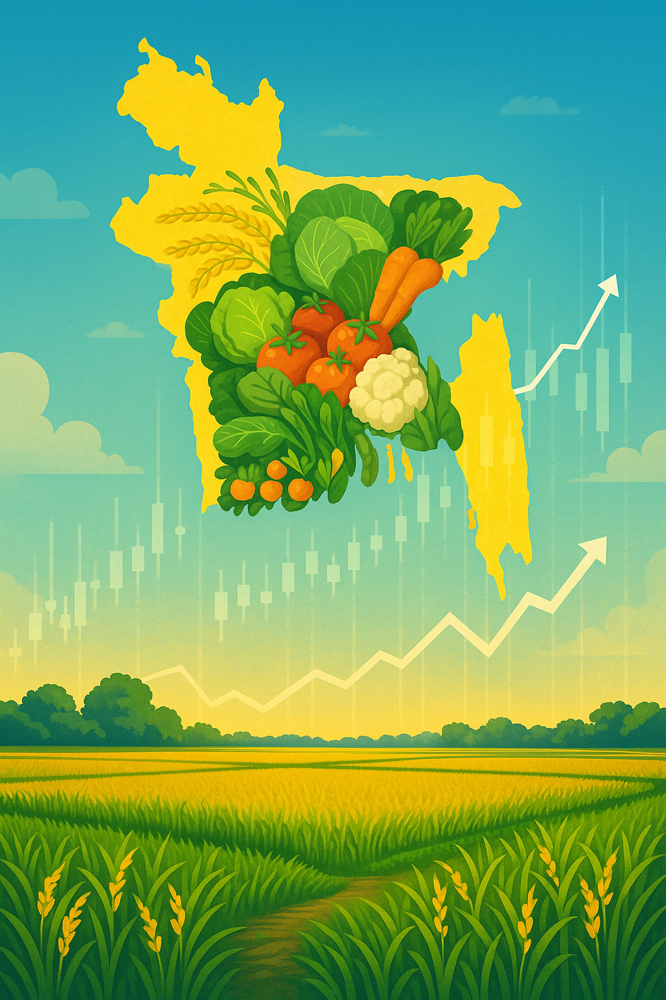

# HarvestHub‑BD



HarvestHub‑BD is a modern commodity price dashboard for Bangladesh.  It helps farmers, traders and consumers stay informed about price trends across the country.  The application provides interactive charts, division‑level filtering and a credential‑protected admin panel for managing commodities.

## Why HarvestHub‑BD?

Food prices in Bangladesh have been highly volatile; food inflation reached **14.10 % in July 2024** and remained around **7.08 % in October 2025**【[tradingeconomics.com](https://tinyurl.com/5xdbvcf7)】.  Having easy access to reliable commodity prices can empower farmers and consumers to make informed decisions, reduce uncertainty and encourage more transparent markets.  HarvestHub‑BD was built with these goals in mind.

## Features

- **Real‑time commodity listings** – the app fetches data from a MongoDB database and displays the latest rates for each commodity.
- **Interactive Bangladesh map** – select a division on the SVG map to filter commodities by region.
- **Search & filter** – quickly find specific commodities via the built‑in search bar.
- **Responsive charts** – visualize price trends over the last 7, 30 or 90 days (or full history) with interactive area and line charts powered by Recharts.
- **Detailed analytics** – each commodity detail page shows average, high, low, daily change, volatility and momentum statistics.
- **Admin dashboard** – a password‑protected admin panel (using NextAuth) allows authorised users to add, update or delete commodity entries.
- **Modern UI** – built with Next.js 16, React 19 and Tailwind CSS for a smooth, responsive experience on both desktop and mobile.
- **Deployed on Vercel** – the live demo is available at [harvesthub-bd.vercel.app](https://harvesthub-bd.vercel.app/).

## Technology Stack

| Layer      | Details |
|-----------|---------|
| Framework | **Next.js 16** with React 19 (App Router) for server‑side rendering and client components |
| Styling   | **Tailwind CSS 4** for utility‑first styling and responsive layouts |
| Data      | **MongoDB** with **Mongoose** models (`Commodity` & `Admin`) |
| Charts    | **Recharts** and **D3‑geo** for plotting price trends and handling SVG maps |
| Auth      | **NextAuth** with a credentials provider for admin authentication |
| Deployment| **Vercel** for hosting the frontend and backend serverless functions |

## Getting Started

To run the project locally, follow these steps:

```bash
# clone the repository
git clone https://github.com/ifti-77/HarvestHub-BD.git
cd HarvestHub-BD

# install dependencies
npm install

# copy `.env.example` to `.env.local` and configure environment variables
cp .env.example .env.local
# set values for:
# MONGODB_URI=<your MongoDB connection string>
# NEXTAUTH_SECRET=<a long random string>

# run the development server
npm run dev
# open http://localhost:3000 in your browser
```

### API Endpoints

HarvestHub‑BD uses Next.js API routes to perform CRUD operations on commodities. Key endpoints include:

- `GET /api/commodity_actions` – returns all commodities.
- `GET /api/commodity_actions/returnOne?uniqueId=<id>` – returns a single commodity.
- `POST /api/commodity_actions` – create a new commodity.
- `PUT /api/commodity_actions` – update a commodity.
- `DELETE /api/commodity_actions` – delete a commodity.

Authentication is required for modifying data (see the admin panel).

### Folder Structure

```
app/
│
├── api/              # Serverless API routes
│   ├── commodity_actions/    # CRUD routes for commodities
│   └── auth/                 # NextAuth configuration
│
├── models/           # Mongoose schemas (Commodity, Admin)
├── lib/              # Database connection helper
├── Component/        # React components (Navbar, Commodity card, StaticBDMap)
├── page.js           # Home page
└── public/maps/      # Bangladesh SVG map used for division selection
```

## Contributing

Contributions are welcome!  Feel free to submit pull requests for bug fixes, enhancements or new features.  For major changes please open an issue first to discuss what you would like to change.

When contributing:

- Fork the repository and create your branch from `main`.
- Follow the existing code style and naming conventions.
- Test your changes thoroughly.

## License

This project is licensed under the [MIT License](LICENSE).

## Acknowledgements

- [Trading Economics – Bangladesh food inflation](https://tradingeconomics.com/bangladesh/food-inflation) for highlighting recent food inflation figures【754421454029421†L140-L144】.
- [Next.js](https://nextjs.org/) and the open‑source community for providing the underlying tools and ecosystem.
